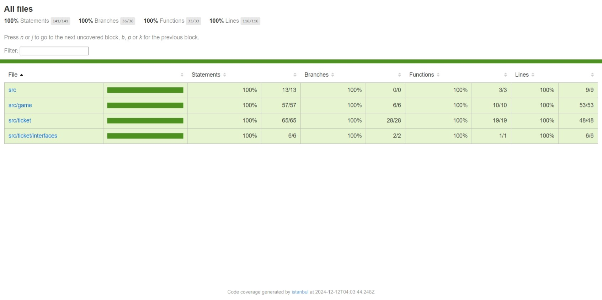
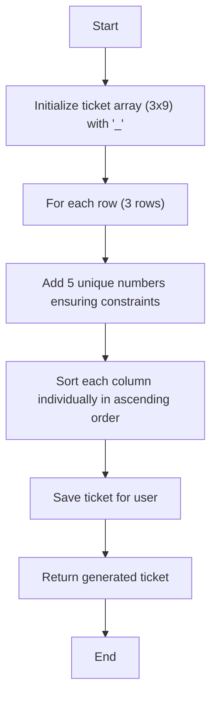
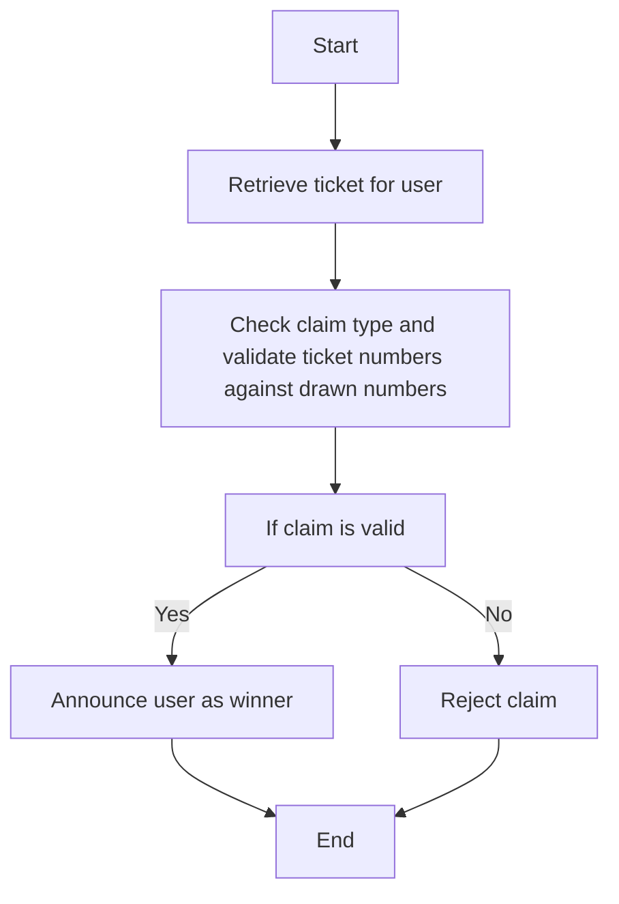
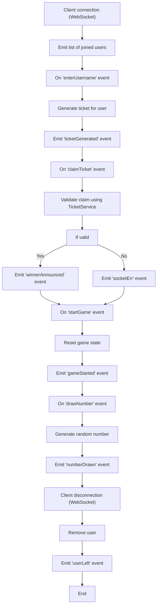
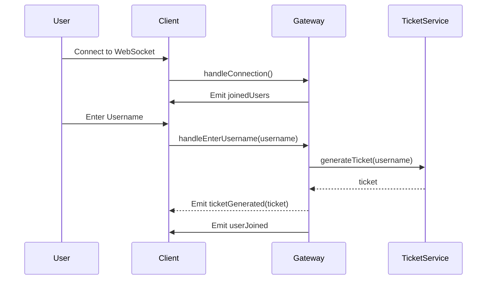
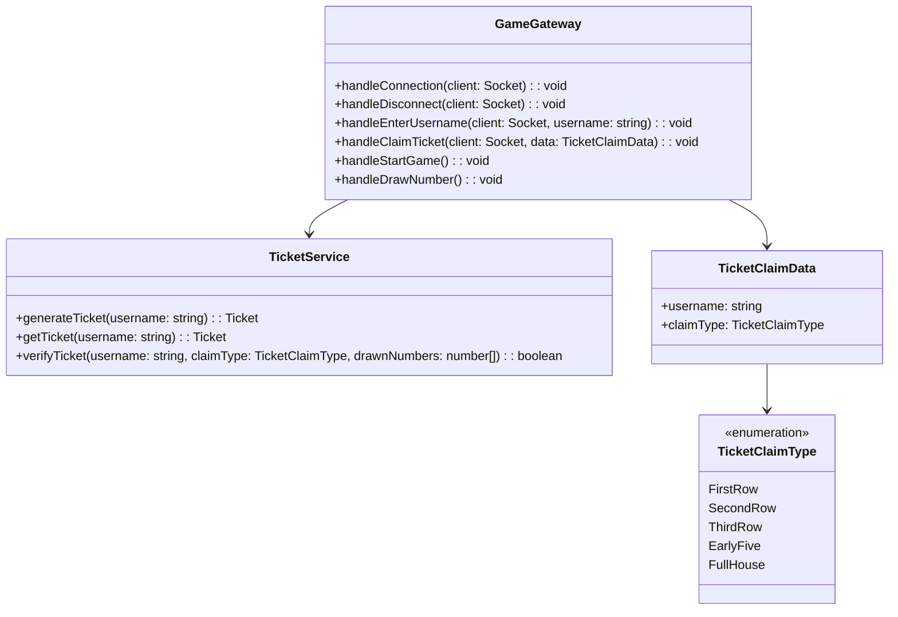

# Tombola

## Overview
This project implements a Tombola using NestJS. The service generates bingo tickets, verifies ticket claims, and manages a real-time game through WebSockets.

## Features
- **Ticket Generation**: Generates a 3x9 bingo ticket with specific constraints.
- **Ticket Verification**: Verifies ticket claims based on drawn numbers.
- **Real-Time Game Management**: Manages user connections, ticket generation, claims, and number drawing in real-time.

## Setup
Follow these steps to set up and run the application.

### Prerequisites
- Node.js
- npm

### Installation
1. Clone the repository:
   - `git clone https://github.com/harsh2792/tombola.git`
   - `cd tombola`
2. Install dependencies:
   - `npm install`

### Running the Application
1. Start the application:
   - `npm run start`
2. The application will be available at `http://localhost:3000`.

## Testing
This project uses Jest for testing. You can run unit tests, integration tests, and generate a code coverage report.

### Running Tests
- To run all tests: `npm test`
- To run unit tests: `npm run test:unit`
- To run integration tests: `npm run test:integration`

### Generating Code Coverage Report
- To generate a code coverage report: `npm run test:coverage`
- The coverage report will be generated in the `coverage` directory.

img




## Project Structure
```
.
│
├───html
│       index.html
│       script.js
│       style.css
│
├───src
│   │   app.controller.spec.ts
│   │   app.controller.ts
│   │   app.module.ts
│   │   app.service.ts
│   │   main.ts
│   │
│   ├───game
│   │       game.controller.spec.ts
│   │       game.controller.ts
│   │       game.gateway.spec.ts
│   │       game.gateway.ts
│   │
│   └───ticket
│       │   ticket.controller.spec.ts
│       │   ticket.controller.ts
│       │   ticket.module.ts
│       │   ticket.service.spec.ts
│       │   ticket.service.ts
│       │
│       └───interfaces
│               iTicket.service.ts
│
└───test
        app.e2e-spec.ts
        game.gateway.e2e-spec.ts
        jest-e2e.json
```

## Flow charts

### 1. **Ticket Generation Flowchart**



### 2. **Ticket Verification Flowchart**



### 3. **WebSocket Event Handling Flowchart**



### 4. **Sequence Diagram**



### 5. **Class Diagram**


